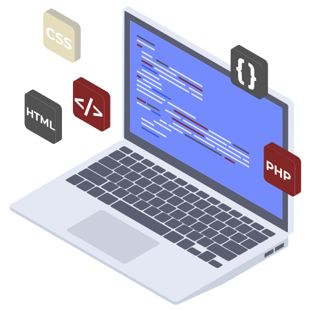

<!DOCTYPE html>
<html lang="en">
<head>
    <meta charset="UTF-8">
    <meta http-equiv="X-UA-Compatible" content="IE=edge">
    <meta name="viewport" content="width=device-width, initial-scale=1.0">
    <link rel="stylesheet" href="Style.css">
    <link rel="preconnect" href="https://fonts.gstatic.com">
    <link href="https://fonts.googleapis.com/css2?family=Josefin+Sans:ital,wght@0,100;0,200;0,300;0,400;0,500;0,600;0,700;1,100;1,200;1,300;1,400;1,500;1,600;1,700&display=swap" rel="stylesheet">
    <link rel="stylesheet" href="https://cdnjs.cloudflare.com/ajax/libs/font-awesome/5.15.3/css/all.min.css" integrity="sha512-iBBXm8fW90+nuLcSKlbmrPcLa0OT92xO1BIsZ+ywDWZCvqsWgccV3gFoRBv0z+8dLJgyAHIhR35VZc2oM/gI1w==" crossorigin="anonymous" referrerpolicy="no-referrer" />
    <title>AG- Sistemas para internet</title>
</head>
<body>
    

    

        <nav>
            <h2 class="logo">AG</h2>
            <ul class="cabeçalho-link">
                <li><a href="#">Inicio</a></li>
                <li><a href="#">Sobre</a></li>            
                <li><a href="#">Habilidades</a></li>
                <li><a href="#">Contato</a></li>
            </ul>
            <a href="#" class="btn">Saiba mais</a>
        </nav>

        

            <h4>Ola, meu nome é</h4>
            <h1>André Grassi</h1>
            <h3>Eu sou desenvolvedor web</h3>
            

                <form>
                    <input type="email" nome="email" id="mail" placeholder="Envie seu Email">
                    <input type="submit" name="submit" value="Começar">
                </form>
            

        

    

    

    <section class="background-color-Sobre">
        

            
            

                <h2>Sobre-Mim</h2>
                <h5>Desenvolvedor web</h5>
                
Olá, me chamo André Luis Grassi tenho 21 anos e sou um Desenvolvedor Web, atualmente já trabalhando na área. Moro em Balneário Piçarras - SC e estou cursando faculdade de Ciência da Computação na Universidade do Vale do Itajaí -UNIVALI.

                <button type="button">Vamos conversar</button>
            

        

    </section>

    

    

        

            <h2>Habilidades</h2>
        

        

            

                <i class="fas fa-bars"></i>
                <h5>Desenvolvimento web</h5>
                

                    
Possuo um bom conhecimentos em desenvolvimento web, familiaridade nas linguagens HTML, CSS e JavaScript, C#, PHP. Tenho alguns cursos e projetos como experiência e estou trabalhando na área 

                    <button type="button">Ler Mais</button>
                

            

            

                <i class="fas fa-user"></i>
                <h5>C++</h5>
                

                    
Bom conhecimento na linguagem de programação C++, apesar de não aplicar  a linguagem em todos os meus projetos comecei a estudar a linguagem assim que entrei na faculdade e possuo um certo conhecimento 

                    <button type="button">Ler Mais</button>
                

            

            

                <i class="fas fa-bell"></i>
                <h5>Python</h5>
                

                    
Primeira linguagem que comecei a estudar, grande facilidade em programar em python assim como possuo bastantes projetos pessoais 

                    <button type="button">Ler Mais</button>
                

            

        

    

    
    
    

        
Entre em contato para mais informações

        <button type="button">Enviar mensagem</button>
    

    
    <footer>
          <h6>André Luis Grassi</h6>
        
Me siga em minhas redes sociais

        

            <a href="#"><i class="fab fa-facebook-f"></i></a>
            <a href="#"><i class="fab fa-instagram"></i></a>
        

        </footer>

    
</body>
</html>
